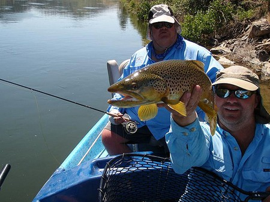
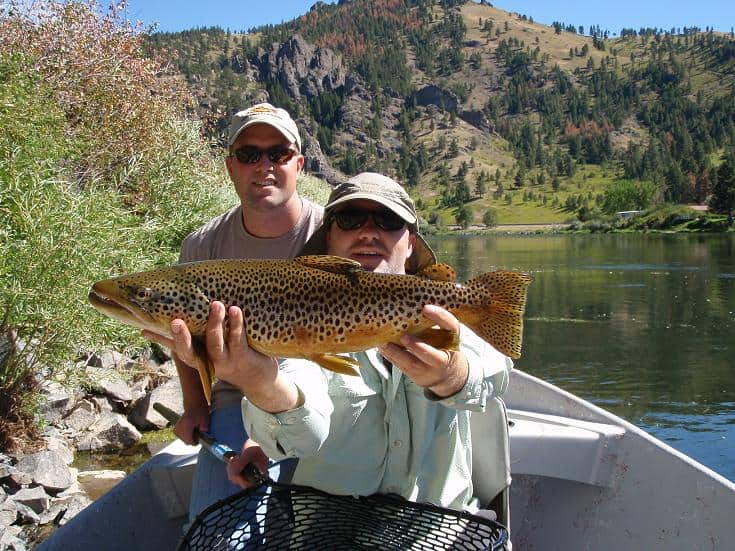
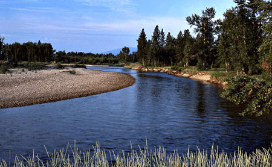
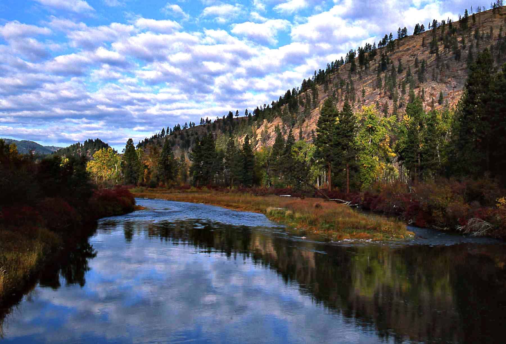
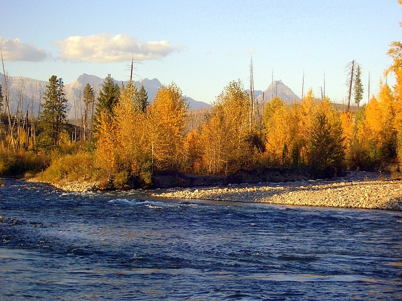

## **Seasoned Professional Guides**

We provide fly fishing guide services on Montana's most productive, scenic rivers. Enjoy fly-fishing the Bitterroot, Clarkfork, Flathead, and the Missouri Rivers. This extensive range of waters is a challenge, whether you're a beginning fly fisher or are a seasoned expert. Our dedicated group of seasoned fly-fishing guides with many years on the water ensures you have a great day of fishing and hospitality. Whether fly-fishing for the elusive 20" brown trout or hunting for a trophy muley, Channel Outfitters gets it done.

* * *

## Missouri River

The best river we fish. The mighty Missouri's reputation speaks for itself! With consistent hatches, rich productivity, and thousands of big fish per mile. Her charm will addict you after only one trip to the world-class Missouri. The Missouri River is always exciting and fishes well from March through November.

* * *

## Bitterroot River

Free-stone river with many side channels full of rainbows, cutthroats, and brown trout. It flows through the Bitterroot Valley, with mountain views to the east and west. There is no shortage of any big fish. The Bitterroot is a very productive river with many hatches. It fishes well in the spring with Green Drakes and Skwalla Stoneflies.

* * *

## Clark Fork River

Provides the avid fly fisher with excellent opportunities for big rainbow cutthroat. The slow and meandering flows fool many. But these fish are super strong and fight hard in this "big" water. The Clark Fork offers productive surface and sub-surface fishing. Great dry fly action throughout the summer, including caddis, various mayflies, and stoneflies.

* * *

## FlatHead River

A glacial river consisting of three branches, the North, South, and Middle Forks, combining to form the Main Flathead River. Although the system is not as famous as other Western Montana Rivers, it provides good dry fly opportunities for beginner anglers. A very scenic river with Westslope Cutthroat fishing close to Glacier National Park.
