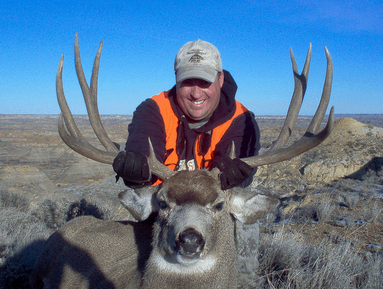
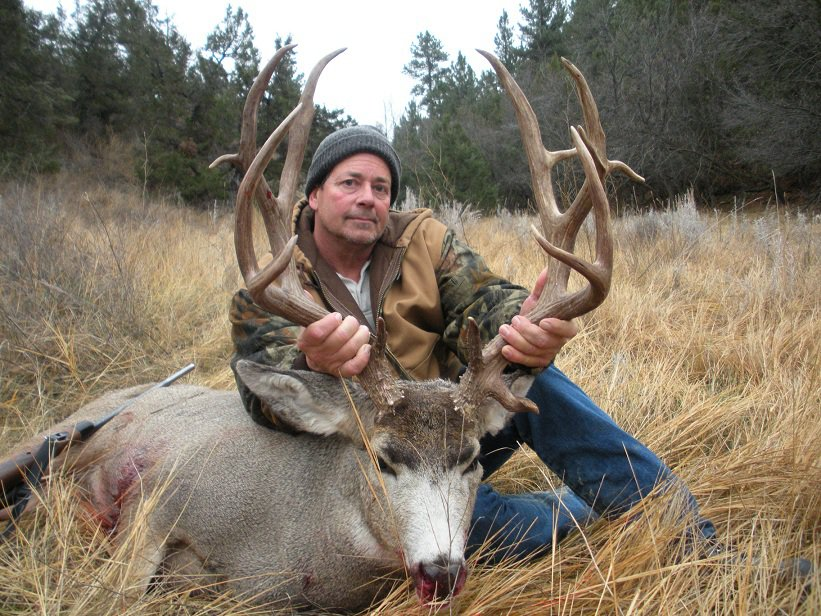
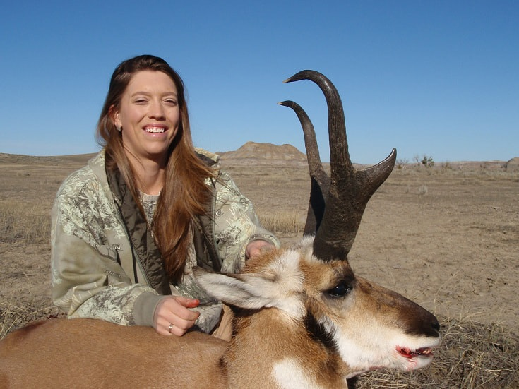

## Big Game Hunting

We offer high-quality big game hunts. Experience trophy Mule Deer, Pronghorn Antelope, and Montana Whitetail Deer in the Big Sky Country. We have some of the best hunting leases on large private ranches. They provide fair chase hunts of the highest standards for rifle and bow hunters through stringent management goals. Montana’s rifle season runs through the entire deer rut, and many of our bigger trophies are harvested during this time. The hunting tags almost always are 100% draws, and we will assist our clients on all licensing matters. Channel Outfitters also offers antelope and deer combo hunts. The antelope tags are near 100%, drawing odds for bow hunts and 40% for rifles.

* * *

## Big Mulies are our specialty!

Our guided Montana deer hunts are of the finest guided mule deer hunts available. We lease hundreds of square miles of prime mule deer habitat to provide our clients with first-class hunting. Eastern Montana is home to some of the best mule deer habitats in North America. We are fortunate to have exclusive leases on some excellent properties making us the clear choice for Miles City Outfitters. Channel Outfitters manages each ranch to produce trophy-quality mule deer. Our ranches are strictly controlled for quality mature animals. Only Channel Outfitters clients can hunt these ranches, ensuring every hunt is an extraordinary experience.

* * *

## Trophy Pronghorn Antelope

We offer trophy antelope hunts with rifles or bows. The antelope hunt is one of the most exciting action-packed hunts, with a rifle and 100% shooting opportunity. This is a great father/son hunt. It is common to see over one hundred antelope a day on most of our ranches making the hunts full of action. Montana antelope bow hunts run through the rut in September. The use of a decoy can create close encounters and fast action. We use blinds at water holes and decoys to get the antelope within bow range. Montana antelope tags are near 100% draw odds for bow hunters. Our antelope hunts are the most affordable guided hunts.
