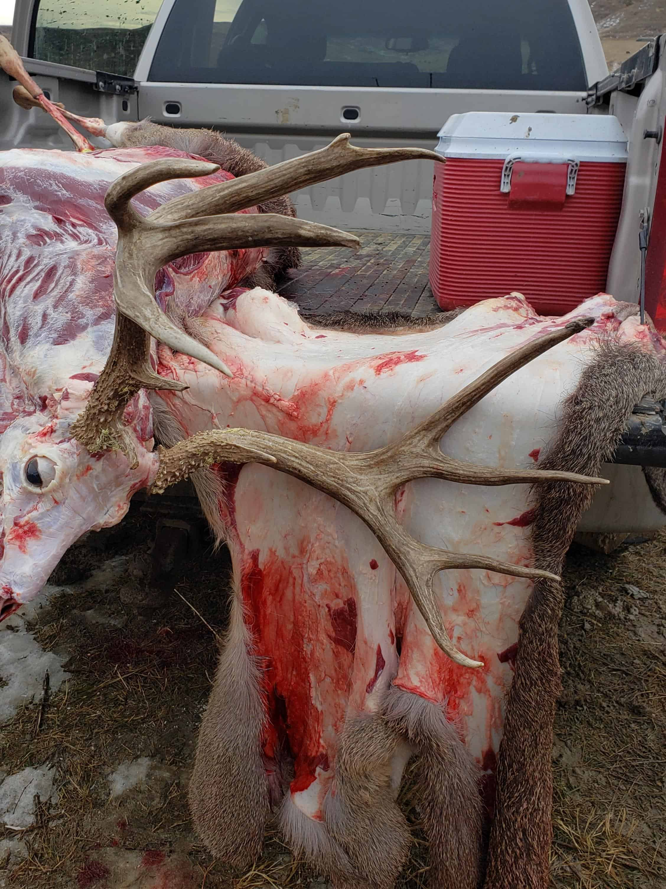

Nick has hunted with us 3 times. He usually lets his brother shoot first. This hunt was the same deal, brother Colby shot a big one on day 2. Nick passed a buck on day 3 that they took pictures of. After seeing the pictures I told him he was crazy! Usually you don't just find bucks like that around every corner.

It came down to the last afternoon of the hunt and now Nick wanted to find the buck he passed a few days back. I can see the look on guides face upon this request. You know the "why didn't you shoot it when it was standing at 100 yards look. My guide Aaron likes a challenge and set out to find the buck we all now called "Hooks". The boys of course went to the area where Hooks was last seen. The spot we call the island, the island is a butte with a flat top covered with a grain field. Bucks come from all directions to breed the does that live there.

The boys walked all around the island looking for Hooks, Lots of deer but not him. The last effort would be to look on top of the island. Not a easy place to hunt, wide open. The boys almost instantly spot Hooks with 5 does. They see him go down a dip and out of sight. They close the distance and peek over to find the big buck starring at them. Aaron hisses shoot. The buck takes off at full speed. Off the island and across a big flat towards the creek, if he makes the creek he will be gone for good.

Nick moves up to the edge, gets prone and tries to find Hooks in his scope. Aaron gives the range as the big buck is leaving the country. Nick lets loose with the new 6.5 Weatherby. Maybe Nick's best shot ever! He took out both lungs at 380 yards with the buck moving out. Aaron backs his truck into camp and comes into the house and says " Hooks is no longer with us, he died of lead poisoning". I would like to note that Aaron had seen this buck 3 years before as younger buck. We had not seen him at all for 2 seasons. He made it to the age we like 6 or 7.

