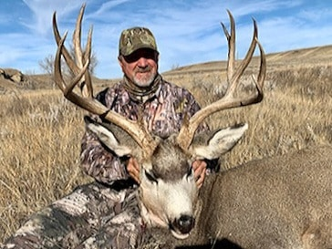

Hunt number two last season was a good one. A cool old guy named Frank, who also purchased a hunt for his nephew came out around November 2. The hunt was about getting Steve on a nice buck. As it sometimes happens, things went well out of the gate. Super guide Aaron spotted a good one from a distance. The pursuit was on and Aaron got in the spot perfectly. When the boys crept over the hill the buck was super close. You could say to close for the buck to handle.

The buck jumped up and took off, guide looking at him and making sure this was a first day shooter. Steve getting a bead on the running deer. Aaron gives his blessing and Steve pulls of a couple of shots before the deer is out of sight. Intense moment I would guess? As the boys walked up on the beast they realized they had a special deer!

Frank was happy about Steve getting his first big one. Aaron was already thinking about where Frank's buck might be!

