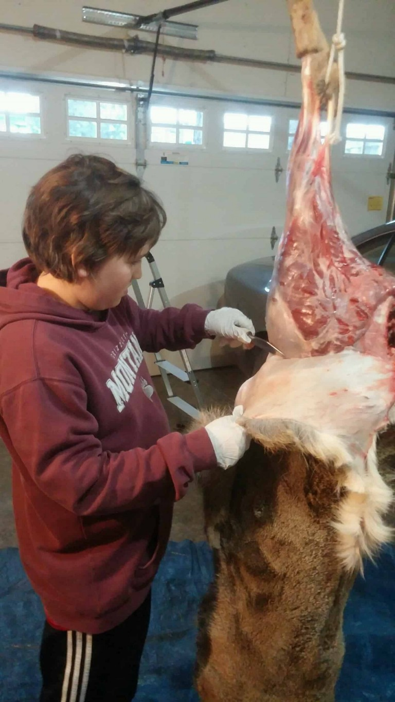

Tis the season for cutting up some meat that is. What a fun time of year. Hopefully you and yours had a safe and prosperous hunting season! I had a great season, I was able to be with my son as he took his very first deer. It was a very special moment, as my son and I laid on the frozen ground, in a pile of cactus. The first morning of his hunt was the coldest day of the 2015 season, -7 with a 35 mile per hour north wind! Not fit for man nor beast. The boy was calm at crunch time! Laying in the cactus with a breath-taking wind in the face, he settled the cross hairs on the sweet spot at 200 yards. we waited for the buck to clear one of his 13 does! When the shot was over the big buck took a few steps and tumbled. My boy knew it was a lethal shot. His smile was priceless!  Mom watched the buck fall from a distance. Grandma and Grandpa went on the recovery. Welcome to the club son!

